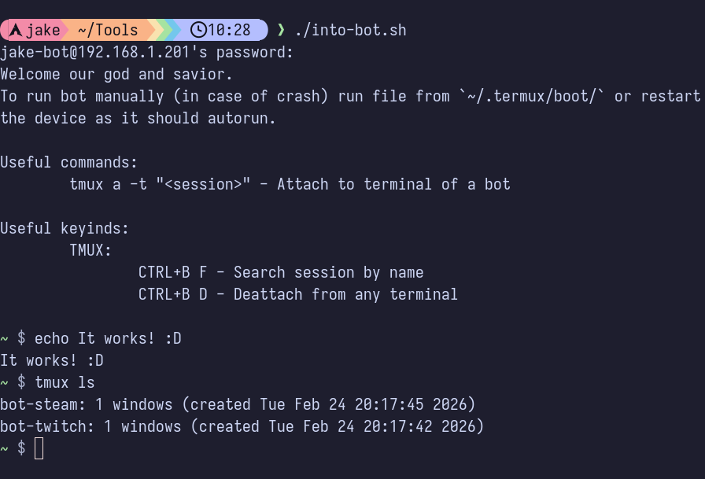

As you may have probably seen before on various places like on Twitter when someone made [working Minecraft server](https://x.com/marshallrichrds/status/2001885260221681848) using phone, you could wonder *"How did they do that?"*

Well in this post I'll try to cover this by explaining the exact magic used behind all of this. It's really useful if you're currently on a budget or just want to make use of your old devices, which is better most of the time!

## Prerequisites